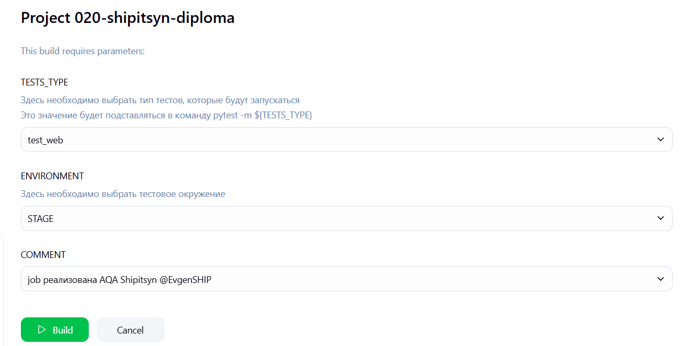
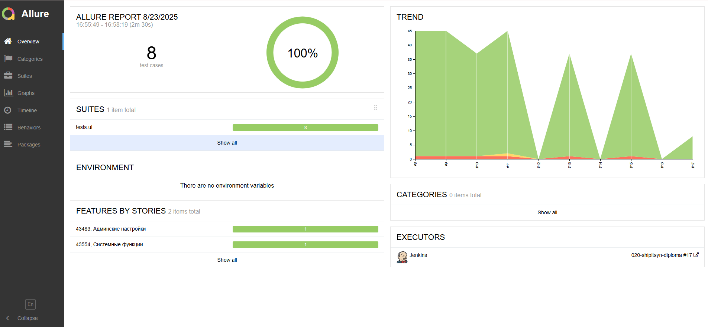
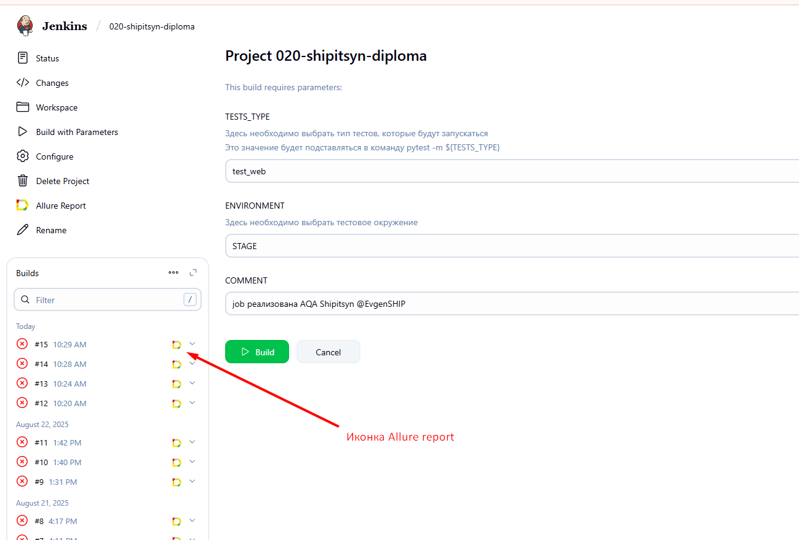
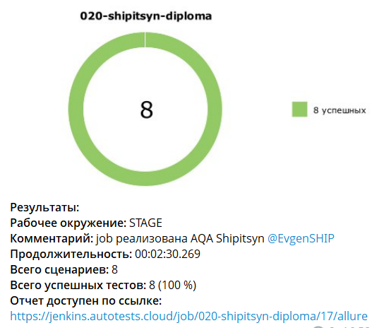

# Пример проекта UI автотестов 

###  Используемые технологии
<p align="center">
  <code></code>
  <code></code>
  <code></code>
  <code></code>
  <code></code>
  <code></code>
  <code></code>
  <code></code>
</p>

## Покрываемый функционал
- Применение и изменение настроек для раздела "Приложение" 
- Проверка осутствия доступа с не валидными логином и паролем

## Запуск тестов
#### Все UI тесты запускаются удалённо (Jenkins), но их можно запустить и локально

### Локально

Для запуска тестов локально, нужно выполнить следующие шаги
1. Склонировать репозиторий
2. Открыть проект в PyCharm
3. Ввести в териминале следующие команды
``` 
python -m venv .venv
source .venv/bin/activate
pip install -r requirements.txt
pytest -m test_web  
```

### С помощью [Jenkins](https://jenkins.autotests.cloud/job/020-shipitsyn-diploma/)
#### Для запуска автотестов необходимо:
 - Открыть [джобу](https://jenkins.autotests.cloud/job/020-shipitsyn-diploma/) в jenkins
 - Нажать на кнопку Build with Parameters
 - Выбрать необходимые значения параметров TESTS_TYPE согласно инструкции 
 - Нажать на Build



## Отчет о прохождении тестов (Allure)
### Локально
Для получения отчета нужно ввести команду 
```
allure serve allure-results
``` 
Ниже представлен пример allure отчета 


### Если тесты запускались в Jenkins

Для получения отчета нужно нажать на иконку allure report'a в строке билда  
У него будет точно такой же формат, как и при получении локально


### В проекте настроена отправка краткого отчета в Telegram
